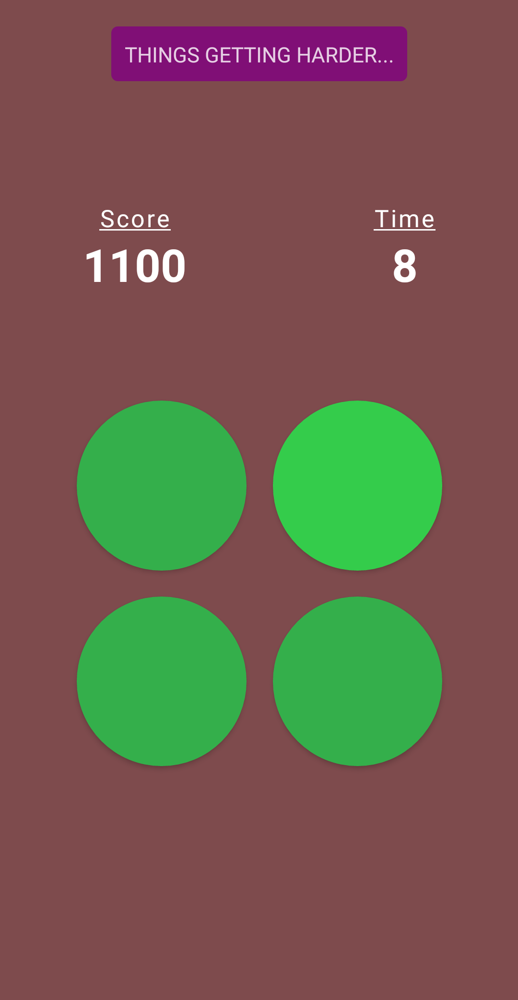

# Color Rush: Find Different Color
Color Rush: Find Different Color is a casual game in which you race against time and try to find the different color among 4 colors before your time runs out.There is no level limitation. As long as you progress in the game, the game continues and the background colors that will mislead your eyes accelerate according to your progress. For this, it uses an algorithm that produces rgba colors.

# Links:
**Google Play Store:** https://play.google.com/store/apps/details?id=com.basicworkslabs.colorrush&pcampaignid=web_share

**AppGallery:** https://appgallery.huawei.com/app/C107856271

# Features:
* Unlimited Levels
* Sound Effects
* Leaderboard

# Build With:
* React Native
* Typescript
* Expo
* Firebase

# Screenshots:

